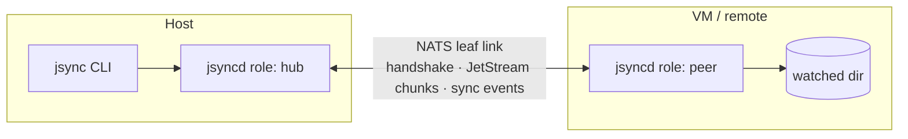

<!--
  Repo URL / module path: this README assumes you publish at
  github.com/marck1391/jsync. Adjust the URLs below and `go.mod`
  (`module jsync` -> `module github.com/<owner>/jsync`) if that differs.
-->

# jsync

**Signal-style `scp`/`rsync`** — file transfer and reactive directory sync between
machines (Host↔VM, P2P, or a central hub) over [NATS] / JetStream, with an
SSH-style Ed25519 identity handshake and optional end-to-end encryption
(X3DH + Double Ratchet).

<p>
  
  
  
  
</p>

```
# one-shot copy, like scp   (vm-01 is an alias you set once with `jsync node add`)
jsync share ./build vm-01:/srv/artifacts

# live two-way sync, like rsync -w / a shared volume — without the polling
jsync watch ./project vm-01:/home/dev/project
```

---

## Table of contents

- [Why jsync](#why-jsync)
- [How it works](#how-it-works)
- [Install](#install)
- [Quick start](#quick-start)
- [Commands](#commands)
- [Configuration](#configuration)
- [Security model](#security-model)
- [Project layout](#project-layout)
- [Development](#development)
- [Status & roadmap](#status--roadmap)
- [License](#license)

---

## Why jsync

- **Two-way live sync** — a native filesystem watcher (Windows `ReadDirectoryChangesW`,
  Linux/macOS `notify`) on both ends. Edits, renames and deletes propagate in either
  direction; an initial reconciliation converges diverged trees before live sync starts.
- **No shared filesystem, no polling** — replaces NFS/SMB volumes and `rsync` cron loops
  for the Host↔VM / Host↔container case.
- **Atomic transfers with resume** — `share` streams a `tar`/`gzip` chunk stream through
  JetStream into a sandbox, then commits atomically. A dropped connection resumes on the
  next attempt, skipping whatever the destination already has (per-file granularity).
- **SSH-style trust** — every node has an Ed25519 identity; you exchange public keys into
  an `authorized_clients` file, exactly like `authorized_keys`.
- **Optional E2E encryption** — `--encrypt` runs the payload through X3DH + a classic
  Double Ratchet, so the NATS broker never sees plaintext.
- **Conflict detection, not last-write-wins** — version vectors flag genuine concurrent
  edits and land the losing side as `*.conflict-<peer>-<ts>` instead of overwriting.
- **`.jsyncignore`** — gitignore syntax, plus a built-in skip list (`node_modules/`,
  `.git/`, `.jsync/`, …).
- **Operation audit log** — every mirrored write/rename/delete and its outcome
  (`applied` / `conflict` / `stale`), queryable with `jsync log`.

## How it works

Two binaries, following the `ssh` / `sshd` split:

| Binary   | Role |
|----------|------|
| `jsyncd` | Long-running node. Boots as a **hub** (embedded NATS broker) or a **peer** (leaf node to a hub), answers handshakes, consumes transfers, and runs the watcher for live-sync sessions. |
| `jsync`  | Short-lived client. Talks to the local `jsyncd` to trigger `share` / `watch` / `keys` / `allow` / `log`. |



- **Topology is a config choice, not a hierarchy.** Any node can be `hub` or `peer`.
  P2P is a hub + a peer; a central server is one hub with many peers.
- **Three independent key systems**, each solving a different problem: NATS NKeys
  (broker connection), Ed25519 (identity handshake), X25519 (X3DH session).

## Install

### Build from source

Requires **Go 1.26+**.

```bash
git clone https://github.com/marck1391/jsync
cd jsync
go build -o jsync  ./cmd/jsync
go build -o jsyncd ./cmd/jsyncd
# then move them onto your PATH
```

### `go install`

Works once `go.mod`'s module path is the repo URL
(`module github.com/<owner>/jsync`):

```bash
go install github.com/marck1391/jsync/cmd/jsync@latest
go install github.com/marck1391/jsync/cmd/jsyncd@latest
```

## Quick start

A hub (say, your laptop) and a peer (a VM). Run each block on the machine named.

### 1. Hub — write `jsync.yaml` and start the daemon

```yaml
# jsync.yaml
role: hub
host: 0.0.0.0
port: 4222
leaf_node_port: 7422
allowed_dest_paths:
  - /srv/inbox        # peers may only write here (omit the key for "anywhere")
```

```bash
jsyncd &            # prints:  jsyncd: ready   machine_id: <HUB_ID>   ...
jsync keys show     # -> machine_id + public_key   (share the public_key with the peer)
```

### 2. Peer — point at the hub, start the daemon

```yaml
# jsync.yaml
role: peer
hub_leaf_node_url: nats://HUB_HOST:7422
```

```bash
jsyncd &
jsync keys show     # copy this public_key back to the hub
```

### 3. Exchange trust (both directions)

```bash
# on the hub
jsync keys authorize <PEER_PUBLIC_KEY>
# on the peer
jsync keys authorize <HUB_PUBLIC_KEY>
```

### 4. Name the other side (optional but nicer)

Instead of pasting `machine_id`s everywhere, give them aliases:

```bash
# on the hub
jsync node add vm-01 <PEER_MACHINE_ID>
# on the peer
jsync node add hub <HUB_MACHINE_ID>
```

### 5. Transfer / sync

```bash
# from the hub: one-shot copy into the peer's allowed root
jsync share ./release vm-01:/srv/inbox/release

# live two-way sync
jsync watch ./project vm-01:/srv/inbox/project

# encrypted (broker sees only ciphertext)
jsync share --encrypt ./secrets vm-01:/srv/inbox/secrets
```

A raw `machine_id` still works anywhere an alias does.

> On the same host, `jsync` and `jsyncd` share one `jsync.yaml`; the client connects to
> the daemon already listening on `host:port`.

## Commands

### `jsync`

| Command | Description |
|---|---|
| `jsync keys show` | Print this node's `machine_id` and base64 public key. |
| `jsync keys authorize <base64-pubkey>` | Trust a peer's key (appends to `authorized_clients`). |
| `jsync node add <alias> <machine-id>` · `rm <alias>` · `ls` | Manage friendly names for peers in the config's `nodes:` map (edited in place, comments preserved). |
| `jsync share [flags] <local-path> <node\|machine-id>:<dest-path>` | One-shot copy of a file or directory. A single file lands as `<dest-path>/<filename>` (dest is treated as a directory). |
| `jsync watch [flags] <local-dir> <node\|machine-id>:<dest-dir>` | Live bidirectional sync until `Ctrl+C`. |
| `jsync allow <path>` · `--remove <path>` · `--list` | Add / drop / list `allowed_dest_paths` in the config file (edited in place, comments preserved). |
| `jsync log [flags] [root]` | Show the mirrored-operation audit log. |
| `jsync pull`, `jsync resolve` | Not implemented yet. |

Targets accept a `nodes:` alias or a raw `machine_id`, interchangeably.

A **relative `<dest-path>`** (`peer:./sub`, `peer:out`) is resolved by `jsync` against
the directory you run it from, then sent as an absolute path — so it still has to land
inside one of the daemon's `allowed_dest_paths`. Run `jsync` from a directory that also
exists on the daemon (the common case: same host) for this to be useful. An absolute
`<dest-path>` — including a POSIX `/srv/x` from a Windows client — is sent unchanged.

**`share` flags:** `--config`, `--encrypt`, `--timeout` (10s), `--transfer-timeout` (2m),
`--retries` (2, auto-resumes), `--retry-wait` (3s).

**`watch` flags:** `--config`, `--encrypt`, `--timeout` (10s).

**`log` flags:** `--config`, `--session <id>`, `--path <substr>`,
`--since <RFC3339 | 2006-01-02 | "2006-01-02 15:04:05">`, `--json`, `--files`.

### `jsyncd`

```
jsyncd [--config <path>]
```

Runs until `SIGINT` / `SIGTERM`, then drains in-flight sessions gracefully.

## Configuration

`jsync` and `jsyncd` resolve the config file in this order:

1. `--config <path>`
2. `$JSYNC_CONFIG`
3. `./jsync.yaml` (current directory)
4. `$XDG_CONFIG_HOME/jsync/config.yaml` (else `~/.config/jsync/config.yaml`)

Relative internal paths are resolved **against the config file's directory**, so `.jsync/`
lives next to `jsync.yaml` wherever it is. A missing config file is not an error — the
zero-config defaults boot a local hub.

### Full reference

```yaml
role: hub                 # "hub" (embedded broker) | "peer" (leaf node) — default: hub
machine_id: ""            # optional; generated and persisted to identity.json on first run

host: 127.0.0.1           # NATS client listen/connect address
port: 4222
leaf_node_port: 7422      # hub only — where peers attach
hub_leaf_node_url: ""     # peer only — REQUIRED for role: peer, e.g. nats://hub:7422

nodes:                    # friendly aliases for `share` / `watch` targets.
  hub: HUB-machineid      # local addressing only — not sent anywhere, grants no trust.
  vm-01: VM-machineid     # managed with `jsync node add/rm/ls`.

one_time_prekey_count: 10 # X3DH one-time prekeys kept in the pool
max_payload_bytes: 1048576

allowed_dest_paths:       # roots a peer may write to; empty = unrestricted.
  - /srv/inbox            # accepts a single string or a list. `allowed_dest_path`
  - /home/me/shared       # (singular) still works as a deprecated alias.

audit_log: true           # Fase 6 operation log; set false to disable
audit_log_dir: .jsync/audit

# Paths below default under .jsync/ next to the config file:
# identity_path:            .jsync/identity.json
# authorized_clients_path:  .jsync/authorized_clients
# prekeys_path:             .jsync/prekeys.json
# jetstream_store_dir:      .jsync/data/jetstream

debug: false
```

Everything the daemon owns lives under **`.jsync/`**, which is in the default ignore list —
private keys never travel with a synced tree even if the daemon runs inside one.

## Security model

Four layers, combining NATS infrastructure security with app-level access control and
encryption (SSH + Signal in spirit):

| Layer | Mechanism | Answers |
|---|---|---|
| 1 · Network | TLS on the NATS transport | "is the wire private?" |
| 2 · Broker | NATS NKeys / subject ACLs | "may this connection touch these subjects?" |
| 3 · Identity | Ed25519 challenge–response, `authorized_clients` | "who are you, and do I trust you?" |
| 4 · Content | X3DH + Double Ratchet (`--encrypt`) | "can the broker read the bytes?" — no |

The handshake binds `requested_dest_path`, direction and the encrypt flag into the
signature, so a relay can't redirect an approved transfer, flip `share`↔`watch`, or
silently downgrade an encrypted session.

## Project layout

```
cmd/
  jsync/        short-lived client
  jsyncd/       persistent daemon
internal/
  identity/     Ed25519 identity, authorized_clients
  handshake/    challenge-response, session store
  transport/nats/  hub/peer bootstrap, subjects, streams
  pipeline/     tar/gzip chunk stream, sandbox + atomic commit, resume
  crypto/x3dh/  X3DH session establishment
  crypto/ratchet/  Double Ratchet
  daemon/       dispatcher, ReceiveSession / WatchSession, graceful drain
  watch/        native per-OS filesystem watcher
  syncfs/       event protocol, echo suppression, conflicts, reconciliation
  ignore/       .jsyncignore (gitignore syntax) + defaults
  config/       jsync.yaml load + resolution
  progress/     transfer progress bar
  auditlog/     mirrored-operation log
```

## Development

```bash
gofmt -l .        # must print nothing
go build ./...
go vet ./...
go test ./...     # real embedded NATS + real filesystem, no mocks
```

Tests run an embedded NATS server and touch the real filesystem. Several past bugs only
surfaced running the actual binaries, so changes to the handshake / transfer / watch flow
are also verified by hand with `jsync` / `jsyncd` (and cross-platform against a Linux VM).

## Status & roadmap

All seven phases are implemented, tested, and wired into the binaries.

- **1** identity, signed handshake, hub/peer over a real NATS leaf node
- **2** tar/gzip chunk streaming, atomic commit, network-recovery resume
- **3** X3DH + Double Ratchet, `--encrypt`
- **4** daemon: dispatcher, session types, graceful drain
- **5** bidirectional watcher, conflict detection, `.jsyncignore`, initial reconciliation
- **6** operation audit log (`jsync log`)
- **7** rename to `jsync`, `allowed_dest_paths` list + `jsync allow`, config resolution

**Next (performance, not correctness):** partitioned consumer lanes for the event
stream, redirecting large `watch` files through the phase-2 pipeline, on-disk X3DH
session cache between transfers, live re-reconciliation after a watcher buffer overflow.

## License

No `LICENSE` file yet — add one before publishing. MIT or Apache-2.0 are the usual
choices for a CLI like this.

[NATS]: https://nats.io
